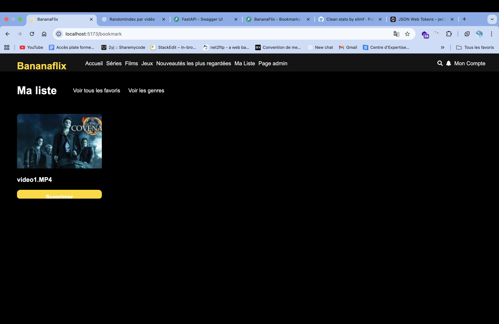
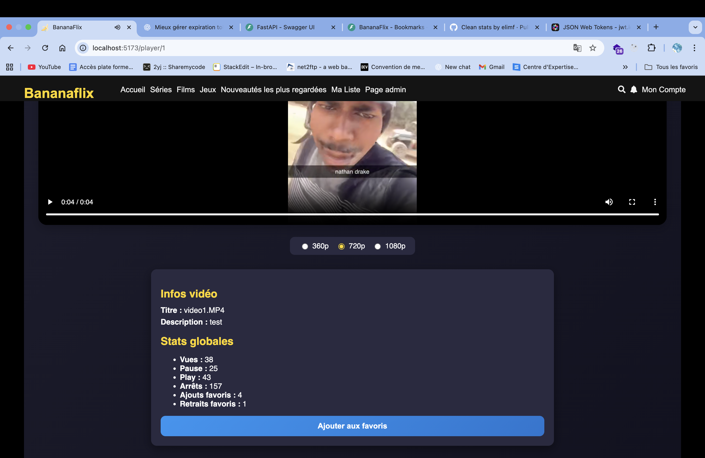
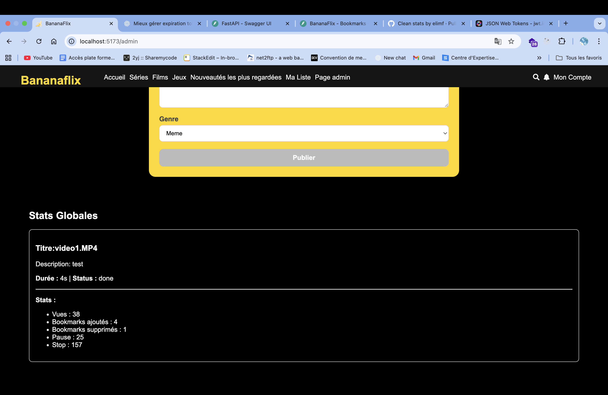
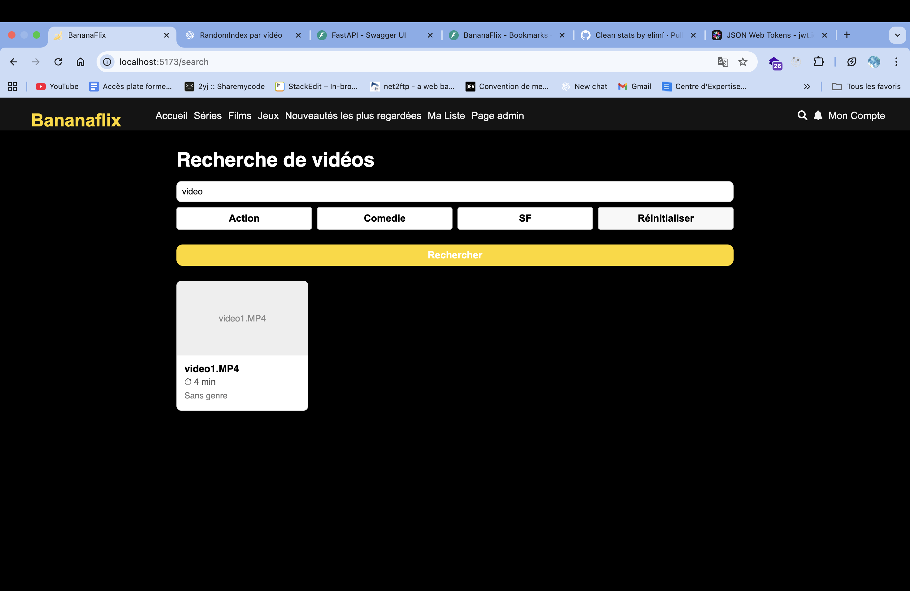

# 🔎 Fonctionnalités non présentées

Ce document décrit les éléments que nous n’avons pas eu le temps de présenter lors de la soutenance/démo.

---

## 📌 1. La liste de favoris

Un aperçu de la liste de favoris :

* Pour ajouter une vidéo aux favoris, il faut lancer la vidéo. Sous celle-ci, on a la possibilité de consulter les statistiques et d’ajouter la vidéo aux favoris.
* Pour retirer un élément des favoris, il suffit de le désélectionner directement dans la liste.

---

## 📌 2. Statistiques globales et d’une vidéo

Comme expliqué précédemment, les statistiques d’une vidéo sont disponibles sous la vidéo avec des informations complémentaires.
De plus, dans la partie **admin**, sous le formulaire d’upload, on dispose d’une vue d’ensemble sur les statistiques globales de toutes les vidéos.

---

## 📌 3. La recherche

Une fonctionnalité de recherche permet d’accéder directement à une vidéo.

---

## ✅ Conclusion

Ces fonctionnalités viennent compléter ce qui a été montré lors de la présentation et reflètent l’état actuel du projet.
Il est également possible de **changer la qualité de la vidéo** grâce aux boutons radio affichés sous celle-ci.

